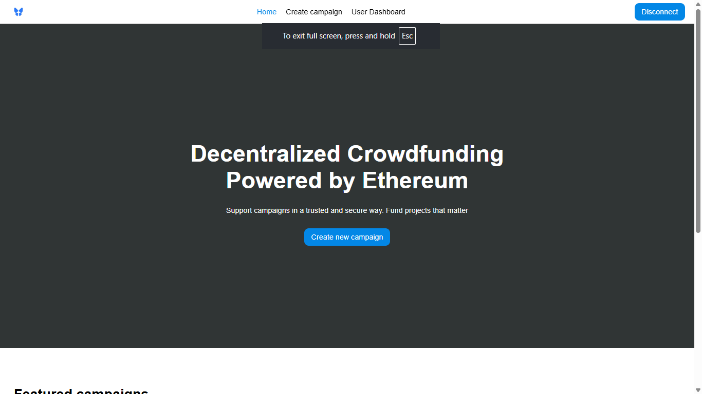
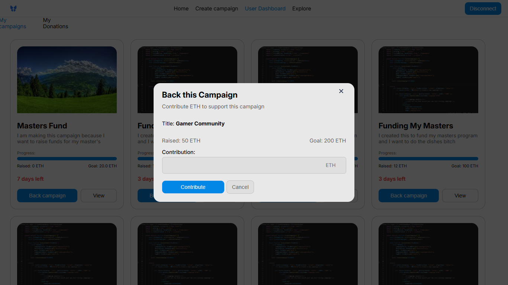
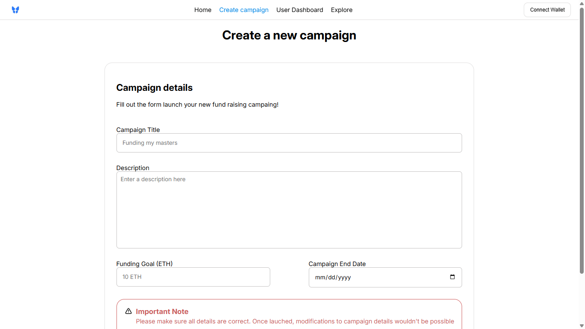
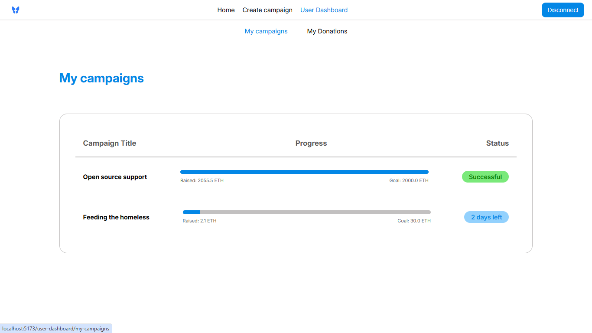
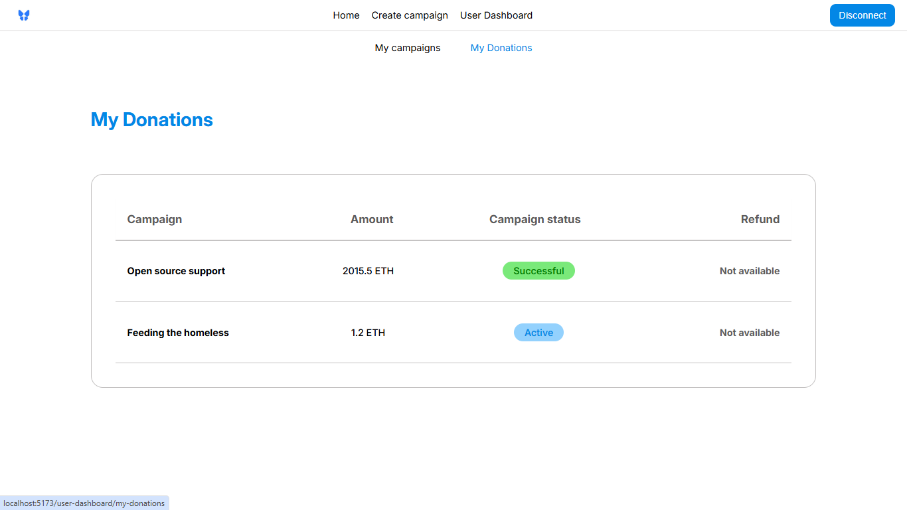

# Decentralized Crowdfunding Project

A decentralized crowdfunding platform built on Ethereum that enables users to **create and fund campaigns** in a transparent and secure manner using smart contracts.

This project leverages **Solidity**, **Foundry**, **React**, and **Ethers.js** to demonstrate a complete Web3 development stack — from on-chain logic to a modern, interactive frontend.

---

## Features

-  **Create Campaigns** — Start fundraising campaigns with a title, goal, image, and description.  
-  **Donate to Campaigns** — Fund projects directly via MetaMask.  
-  **Track Progress** — View campaign balance, state, and contribution details in real time.  
-  **Refunds & Withdrawals** — Failed campaigns allow refunds; successful ones allow withdrawals.  
-  **Wallet Integration** — Seamless MetaMask connection with automatic account change handling.  

---

## 🧠 Tech Stack

| Layer | Technologies |
|-------|---------------|
| **Smart Contracts** | Solidity, Foundry |
| **Frontend** | React, Vite |
| **Blockchain Interaction** | Ethers.js |
| **Development Tools** | Node.js, Makefile |

---

## 🧩 Project Structure
```
crowdfunding-project/
├── 📁 contracts/                  # Smart contracts (Solidity)
│   ├── 📁 src                     # Main source contracts
│   ├── 📁 scripts/                # Deployment or helper scripts
│   └── 📁 tests/                  # Contract tests (Foundry)
│
├── 📁 frontend/  
    ├── 📁 ABIs/                    # Contract ABIs
    └── 📁 src/                     # Frontend source code (React)
        ├──📁 components/           # UI components (e.g. CampaignCard, Modal)
        ├──📁 context/              # State management (e.g. Web3 context)
        ├──📁 pages/                # Page components (Home, CreateCampaign, etc.)
        ├──📁utils/                 # Helper functions and constants
        ├── App.jsx                  # App entry point
        └── index.css                   # styles file
        └── index.jsx                   # React root
````

---

## Smart Contracts

- **Campaign.sol** — Manages a single campaign’s lifecycle (donations, refunds, withdrawals).  
- **CampaignManager.sol** — Factory contract that deploys and tracks all campaigns.  

**Deployed Address (Sepolia):**  
`<SEPOLIA_ADDRESS>` *0xB585a638a387631173368B842ABB238015d9da15*

---

## Prerequisites

Before you begin, ensure you have the following installed:

- 🟢 **Node.js** ≥ v18  
- ⚙️ **Foundry**  
- 🧰 **Make**  
- 🦊 **MetaMask** (browser extension)  

---

##  Quick Start

### 1. Clone the Repository
```bash
git clone https://github.com/only-burata/crowdfunding-project.git && cd crowdfunding-project
```

### 2. Install dependencies
```
npm install
```
### 3. Move into the contracts folder and compile contracts

```
cd contracts && make compile
```
### 3. Start frontend

```
npm run dev
```
### 4. Run tests (make sure you're in the contracts folder)

```
forge test
```
### 3. Deploy contracts locally

```
make deploy-anvil
```
This will deploy the contracts to the local anvil chain. The ABIs will be extracted automatically. Ensure you copy the address of the deployed contract and paste in
the index.jsx file on line 10
```
10.    const managerAddress = "<new deployed address>"
```
---

# Screenshots 
## Home<br>
<br><br>

## Payment modal<br>
<br><br>

## Create Campaigns page<br>
<br><br>

## My Campaings<br>
<br><br>

## My donations<br>
<br><br>

## Campaign details<br>
<br><br>

---

## 👨‍💻 Author

**BURATA BARIZIGA-ORAGE**  
📧 [buratabariziga@gmail.com](mailto:burata.bariziga@gmail.com)  
💼 [GitHub – only-burata](https://github.com/only-burata)  
🌐 [LinkedIn – Burata Bariziga-orage](https://www.linkedin.com/in/burata-bariziga-orage-4562aa338/)

---


